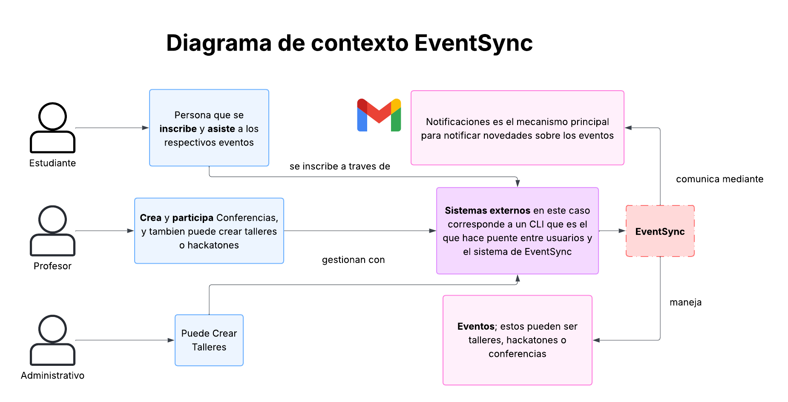

# DOSW_ParcialT1_DanielAhumada
## Parcial de primer tercio 


**Comando usado para iniciar el proyecto**

```
mvn org.apache.maven.plugins:maven-archetype-plugin:3.2.1:generate -DgroupId="edu.dosw.parcial" -DartifactId="DOSW-ParcialT1" -DarchetypeGroupId="org.apache.maven.archetypes" -DarchetypeArtifactId="maven-archetype-quickstart" -DarchetypeVersion="1.5" -DinteractiveMode=false
```

## EventSync

### Diagrama de contexto

Para entender un poco el contexto de nuestra aplicacion podemos observar el siguiente diagrama en el cual tenemos la estructura de como se relaciona con los distintos actores y entidades



---

### Patrones de Diseño

Para el caso de los patrones de diseño se identifico que para este caso podriamos implementar los siguientes patrones:

---

#### Primer patron

a. **nombre:** Factory Method

b. **tipo de patron:** Creacional

c. **justificación:** La razón por la cual este patron encaja en la solucion es que tenemos distintos tipos de eventos y pues dichos eventos tienen parametros en comun como lo son duracion, capacidad y fechas. Entonces a la hora de crear dichos eventos lo mejor podria ser tener una interfaz evento de la que se herede los distintos tipos de eventos

---
#### Segundo patron

a. **nombre:** Mediator

b. **tipo de patron:** Comportamiento

c. **justificación:** Tenemos distintos componentes entre lo que es nuestro sistema. Como lo son la inscripción, notificaciones, creacion de eventos por lo cual con este patron de diseño. Asi que para simplificar un poco la comunicacion entre dichos componentes, lo que hacemos es poner un mediador entre ellas.