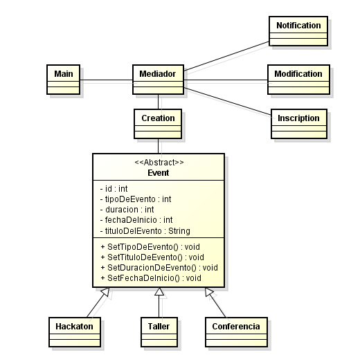

# DOSW_ParcialT1_DanielAhumada
## Parcial de primer tercio 


**Comando usado para iniciar el proyecto**

```
mvn org.apache.maven.plugins:maven-archetype-plugin:3.2.1:generate -DgroupId="edu.dosw.parcial" -DartifactId="DOSW-ParcialT1" -DarchetypeGroupId="org.apache.maven.archetypes" -DarchetypeArtifactId="maven-archetype-quickstart" -DarchetypeVersion="1.5" -DinteractiveMode=false
```

## EventSync

### Diagrama de contexto

Para entender un poco el contexto de nuestra aplicacion podemos observar el siguiente diagrama en el cual tenemos la estructura de como se relaciona con los distintos actores y entidades


---

### Patrones de Diseño

Para el caso de los patrones de diseño se identifico que para este caso podriamos implementar los siguientes patrones:

---

#### Primer patron

a. **nombre:** Factory Method

b. **tipo de patron:** Creacional

c. **justificación:** La razón por la cual este patron encaja en la solucion es que tenemos distintos tipos de eventos y pues dichos eventos tienen parametros en comun como lo son duracion, capacidad y fechas. Entonces a la hora de crear dichos eventos lo mejor podria ser tener una interfaz evento de la que se herede los distintos tipos de eventos

---
#### Segundo patron

a. **nombre:** Mediator

b. **tipo de patron:** Comportamiento

c. **justificación:** Tenemos distintos componentes entre lo que es nuestro sistema. Como lo son la inscripción, notificaciones, creacion de eventos por lo cual con este patron de diseño. Asi que para simplificar un poco la comunicacion entre dichos componentes, lo que hacemos es poner un mediador entre ellas.

---

### 📄 Requerimentos 

Para el tema de requerimientos se identificaron los siguientes:

| Requisito | Funcional |
|------|-------------|
| Poder crear eventos | si |
| Notificar de dichos evento |  si |
| Permitir inscripcion de eventos | si |
| verificar formato | no |
| salidad de consola | no |

---

Dentro de los requisitos los casos de uso mas revelantes son inscribir y crear evento


**COMO** estudiante

**QUIERO** Inscribirmer a un evento

**PARA PODER** participar en el evento


**COMO** profesor

**QUIERO** Crear un evento

**PARA PODER** gestionarlo e invitar a la comunidad


---

# 🤑 Planeación del Sistema

## Desglose de trabajo: Épicas, Historias de Usuario y Tareas

La implementación de los requerimientos identificados de EventSync se desglosa de la siguiente manera:

### 1. Épica:

| Campo | Descripción |
|------|-------------|
| **ID** | EP-01 |
| **Título** | Crear sistema de eventos |
| **Descripción** | *Crear un sistema de registros para que se puedan gestionar los eventos, desde modificarlos hasta inscribirse en ellos* |
| **Stakeholder** | *comunidad educativa* |

### 2. Historias de usuario:

| Campo | Descripción |
|------|-------------|
| **ID** | HU-01 |
| **Título** | |
| **Descripción** | *Como Profesor quiero crear un evento para invitar a la comunidad* |
| **Prioridad** | *[Alta]* |
| **Estimación** | 52 |

| Campo | Descripción |
|------|-------------|
| **ID** | HU-02 |
| **Título** | |
| **Descripción** | *Como Estudiante quiero inscribir un evento para participar en el* |
| **Prioridad** | *[Alta]* |
| **Estimación** | 52 |

### 3. Tareas:

| Campo | Descripción |
|------|-------------|
| **ID** | TR-01 |
| **Título** | crear CLI para registro de eventos |
| **ID de la Historia de Uso asociada** | HU-01 |
| **Descripción** | *Como Profesor quiero poder tener un medio para poder registrar un evento* |
| **Tareas requisito** | *ninguna* |


---

## Diagrama de clases

