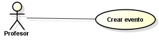
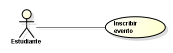

# 📄 Requerimientos del Sistema

## 1. Lista general de requerimientos

El sistema de EventSync tiene los siguientes requerimientos de creacion de eventos donde un profesor o administrador puede crearlo y el de inscripcion en donde un profesor o estudiante puede inscribirse en dicho eventeo:

### 1.1 Requerimientos funcionales

El sistema de Bankify debe tener la capacidad de:

1. Crear eventos
2. Inscribir eventos
3. Notificar usuarios
4. modificar eventos

### 1.2 Requerimientos funcionales

El sistema de Bankify debe tener:

1. Interfaz CLI
2. Sistema de notificaciones CLI
3. Interfaz de eventos
4. Mediador

## 2. Diagramas de caso de uso

### 2.1 Requerimiento Funcional 1

| Campo | Descripción |
|------|-------------|
| **ID** | RF-01 |
| **Nombre del requerimiento** | Creacion de cursos |
| **Descripción** | *El sistema debe permitir la creacion y modificacion de cursos* |
| **Precondiciones** | *Para que el sistema cumpla con este requerimiento, EventSync debe tener previamente un CLI para la entrada de datos* |
| **Actor** | *Profesor y administrador* |
| **Flujo principal** | 1. El actor debe introducir los paramatros del eventos 2. El sistema debe mediar para crear dicho evento 3. El sistema notifica a los inivitados |
| **Diagrama de caso de uso** |  |
| **Poscondiciones** | *Se espera como resultado que los estudiantes puedan isncribir eventos* |

### 2.2 Requerimiento Funcional 2

| Campo | Descripción |
|------|-------------|
| **ID** | RF-02 |
| **Nombre del requerimiento** | |
| **Descripción** | *El sistema debe permitir la inscripción de eventos* |
| **Precondiciones** | *Para que el sistema cumpla con este requerimiento, EventSync debe tener previamente la creacion y eventos correspondientes* |
| **Actor** | *Estudiantes y profesores* |
| **Flujo principal** | 1. El actor Estudiante se inscribe en el curso 2. El sistema debe verificar si es apto 3. El sistema actualiza el estado del evento |
| **Diagrama de caso de uso** |  |
| **Poscondiciones** | *Se espera como resultado que los eventos tengan integrantes * |

